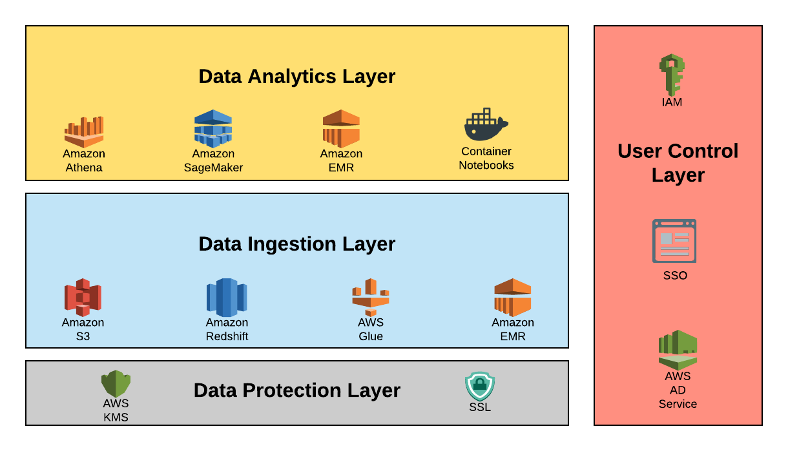
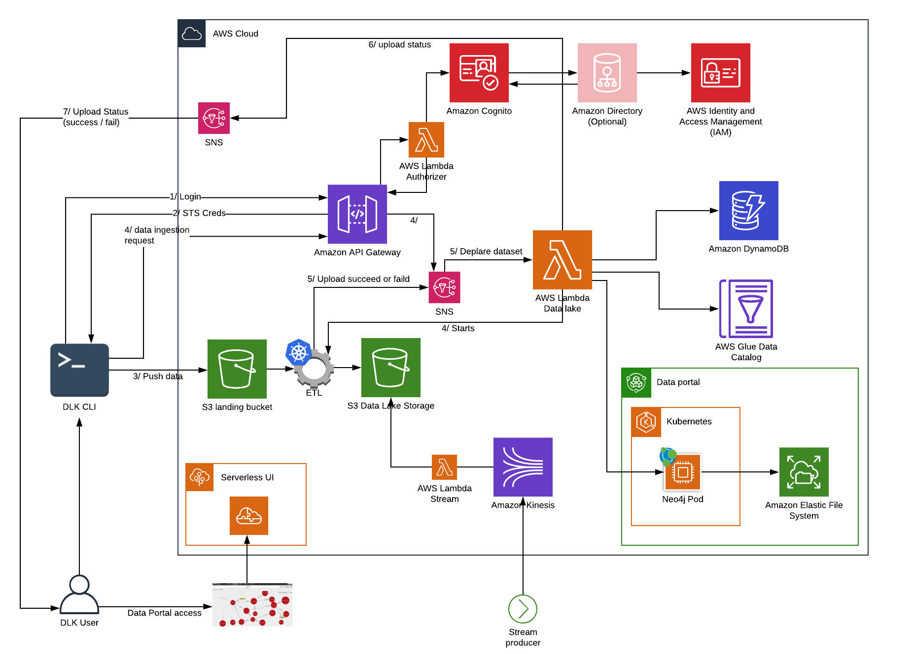
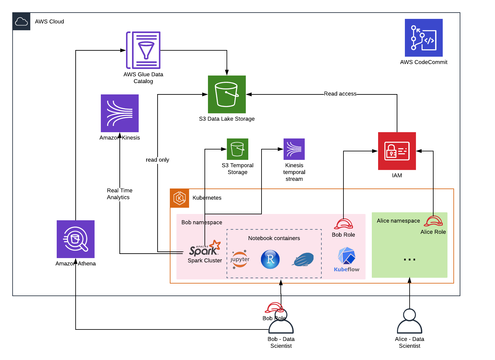
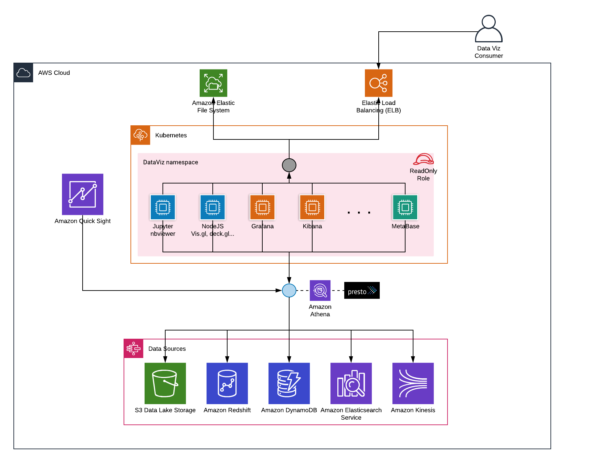
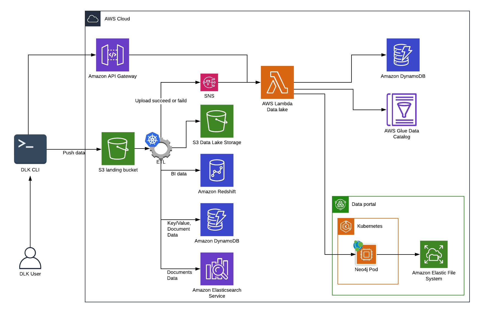

# Vision of a Datalake in AWS
todo !

## Different layers

## Data lake

## Data Analytics

## Data Visualisation

## Data Lake (Extension)

## Usefull links
- https://www.nickaws.net/aws/2018/09/03/Interacting-with-EKS-via-Lambda.html